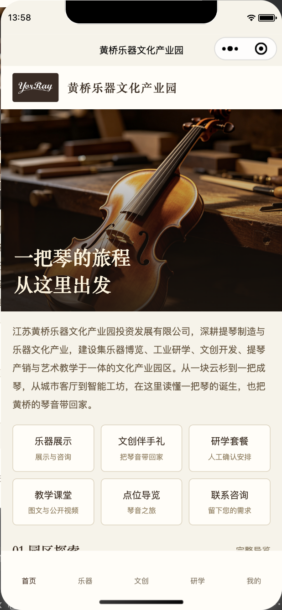
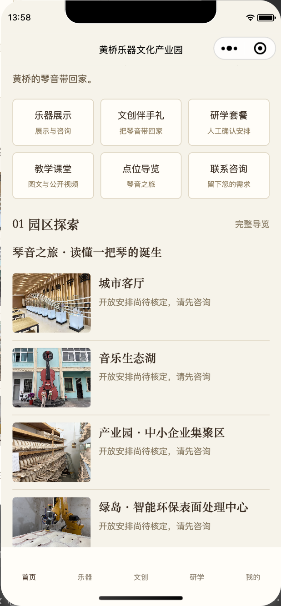
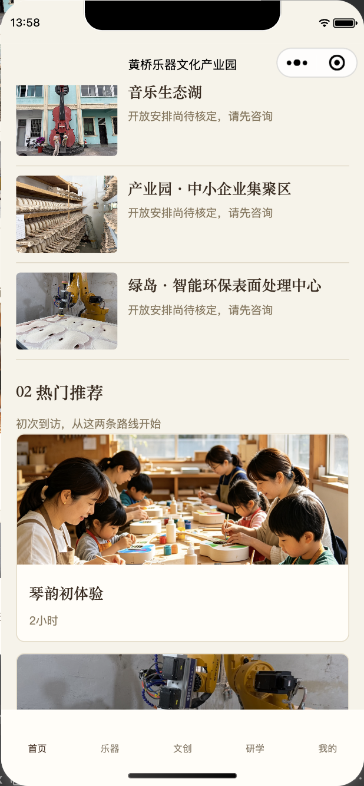
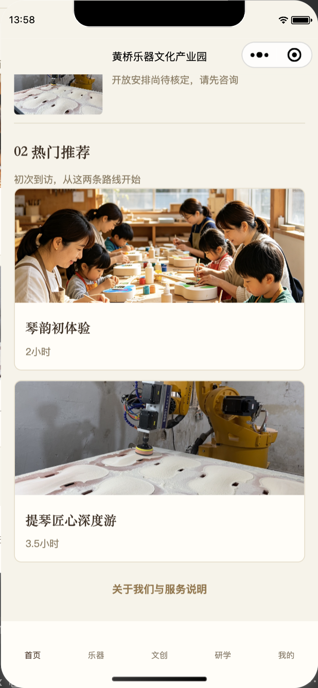

# 当前首页 UI/UX Audit

日期：2026年10月1日；操作者：Codex；源码基线：`4815c68`。范围：**正常内容状态的首页**，包括首屏、六个入口、园区探索、推荐及页尾。未审查后台、不改业务、不重新验收预约系统。结论：当前页面可作为业务基线，摄影与色彩方向适合延续，视觉层级、辅助文字可读性和操作提示需要改进。

## 证据与方法

本轮使用项目已安装的微信官方 `miniprogram-automator` 打开当前工程，在微信开发者工具原生模拟器捕获4个滚动位置，并实际查看截图。页面逻辑窗口为390×671px；截图包含工具呈现的设备外框和系统区域，图片像素不能直接当成逻辑布局尺寸。读取首页公开内容，无表单提交、后台写入、预约或业务数据修改；结束后首页回到顶部。

[原生捕获记录](ui-audit-2026-10-01/capture.json)显示：首页有site内容、4个点位、2个推荐，本轮捕获未记录页面异常；这不等于所有入口、业务流程或网络状态测试通过。4份证据均为本轮捕获。用户提供的 [homepage-current.png](../design-reference/homepage-current.png) 作为补充现状资料保留，不能替代本轮证据。

| 步骤 | 当前视图 | 健康判断 | 证据 |
| --- | --- | --- | --- |
| 1 | 首屏：原生顶栏、品牌条、Hero、完整介绍与入口 | 视觉基础较好，品牌和操作主次需优化 | [01](ui-audit-2026-10-01/01-home-top.png) |
| 2 | 六个服务入口及探索起始区 | 入口齐全，平均卡片布局和浅色小字需改进 | [02](ui-audit-2026-10-01/02-home-services.png) |
| 3 | 四点位探索及推荐起始区 | 内容清楚，但章节编排与点击提示偏弱 | [03](ui-audit-2026-10-01/03-home-explore.png) |
| 4 | 两推荐、页尾与底部导航 | 摄影有感染力，功能提示与信息对比度需改进 | [04](ui-audit-2026-10-01/04-home-recommendations.png) |

健康判断是设计审查意见，不是业务测试结论；本轮没有新增业务失败证据。

## 已确认视觉方向与适用边界

用户明确指定 [首页优化视觉效果图](../design-reference/homepage-target-v1.png)（865×1819px），本轮已查看。它体现提琴近景、暖色电影感、衬线中文、英文辅助、01/02章节、园区大图和图片融合的推荐区，适合“东方乐器文化 × 手工制琴 × 现代产业园”。

| 参考图元素 | 提取方式 | 不能直接复制的原因 |
| --- | --- | --- |
| 工艺提琴大图与暗色文字安全区 | 保留摄影主导及必要遮罩 | 不将参考图整图作为UI或替换已有数据来源 |
| 衬线中文、英文与章节编号 | 形成标题层级与少量辅助排版 | 英文口号、手写字不等于已批准文案或Logo |
| 复合园区大图与推荐分区 | 提取明确分区、图文融合及留白 | 具体全景要与实际素材对应，不能伪造地点 |
| “提琴选购”、底部“提琴” | 按现行“乐器展示”“乐器”解释 | 已批准五类乐器及展示咨询，不能缩回或改商城 |
| 五列快捷入口 | 提取轻量入口的意图 | 当前六项均须保留；五列也容易挤压移动端文字 |
| ￥118/￥158、5/27/8数量及推荐标签 | 本轮不使用 | 未核实价格、宣传计数及标签依据，视觉图不批准业务数据 |
| 大面积圆角浅色卡片与金色按钮 | 仅取局部柔和感 | 用户明确禁止统一卡片模板和金色滥用 |
| 自定义顶栏与导航图标 | 记录为后续可能方向 | Phase 1不改原生导航配置或系统控件 |

参考图整体已确认为方向，不代表每个细节成为约束；具体处理优先遵守本轮用户文字要求及既往业务确认。

## 当前优点

Hero使用手工提琴和木工作台摄影，主体完整、木色自然；深色遮罩使两行标题在当前画面较易读。米白与胡桃木基调已经建立，中文衬线也有文化感，无需另起通用旅游或商城模板。六项服务入口、四个点位、两套餐与关于我们形成清楚内容骨架，适合通过编排升级。当前没有大面积金色、复杂动画或多层阴影，应保留这种克制。

上述是截图观察和设计判断；Hero在其他照片、设备和字体放大状态下的对比度未验证，不据此宣称全部可访问性合格。

## 问题、依据与建议优先级

优先级用于**视觉与可用性实施排序**：P1优先解决可读/操作问题；P2改善品牌与层级；P3后续范围。它不是业务故障严重程度。

| 编号 | 优先级 | 事实依据 | 影响与建议 |
| --- | --- | --- | --- |
| UI01 | P1 | `.quick-grid .sub`为20rpx；浅棕`#947F5E`在`#FFFDF7`上计算3.784∶1 | 辅助服务说明偏小偏浅；建议26rpx、深辅助色，并保留现有文字 |
| UI02 | P1 | `.muted`为24rpx、`#8A795F`，在米白背景上3.805∶1；页尾文字`#967548`为3.840∶1 | 时长、开放说明和可点击页尾读感偏弱；有效普通文字目标至少4.5∶1，不因文化风格降低对比 |
| UI03 | P1 | “完整导览”原生元素测得48×20.398px，绑定在文字元素上 | 点击高度偏小，建议扩大到项目44px操作目标；未检查相邻目标例外，不能单凭测量下结论为WCAG违法或认证失败 |
| UI04 | P2 | 六入口为三列两行、同底色同描边同层级；截图01/02可见 | 缺少“品牌内容—服务动作”的主次；按产品、体验、服务分组，六项保留，不复制五列缩小入口 |
| UI05 | P2 | 原生标题与内容品牌条重复园区名称；大图后是完整介绍，入口位于首屏较下方 | 品牌占高、主要动作不突出；本阶段优化页面品牌条、Hero和入口编排，介绍完整移到品牌故事区。原生顶栏合并另阶段处理 |
| UI06 | P2 | 四点位使用同尺寸横向条目，开放说明重复；截图02/03 | 叙事与产业园摄影表达较弱；利用现有照片与编号形成摄影主区及紧凑条目，保留全部点位和说明 |
| UI07 | P2 | 推荐为同样白色描边大卡，整块可点击但没有明确动作提示；截图04 | 用户可能不易辨识可查看详情；加入明确箭头/文字提示，采用图片主导与开放说明，不添加价格或营销标签 |
| UI08 | P2 | 18个页面样式均主要依赖`app.wxss`，没有集中Token；源文件事实 | 首页改动全局规则会连带其他页面；Phase 1使用首页命名空间和仅首页引用样式，冻结全局文件 |
| UI09 | P3 | 正常截图未覆盖Loading/Empty/Error；源码已有loading/error共享模板及重试 | 不能只验收好看的正常页；后续单独测试原状态，图片失败若需新逻辑先提CR |
| UI10 | P3 | 当前原生tabBar为五项纯文字，参考图包含图标 | 品牌一致性可以后续增强；本阶段保留路径、顺序、原生导航，不立即迁移自定义导航 |

对比度依据为当前源码不透明颜色组合计算，见[计算记录](ui-audit-2026-10-01/contrast.json)。普通文本4.5∶1目标参照[W3C](https://www.w3.org/WAI/WCAG22/Understanding/contrast-minimum.html)；44px为项目舒适度建议，[WCAG 2.5.8](https://www.w3.org/WAI/WCAG22/Understanding/target-size-minimum.html)的最低要求与例外另行评估。本审查不做法律或认证结论。

## 页面与业务保护核对

源码中六入口分别通过既有`tab`或`open`回调进入乐器、文创、研学、教学、导览、咨询；点位和推荐通过当前`id`进入详情，页尾进入关于我们。当前首页无新增购买功能、宣传数据概览或参考价展示。设计应保留这些事实，不能把“参考图更完整”当作恢复旧HTML业务的理由。

现有公司介绍保持完整，用户没有批准缩写；设计可重排位置和行距，不能自行删文案。1∶1要求针对乐器和文创列表，本轮首页推荐不受该比例要求替代，详情图库也不应统一裁为正方形。

## 未执行与实际限制

- 仅查看正常首页四个滚动位置；本轮未逐个点击入口、未新提交预约/咨询、未操作后台，不能声称重新完成业务验收。
- 未执行真机iOS/Android、320/375/430宽度、弱网、图片失败、内容为空、系统字体放大或VoiceOver/TalkBack。
- 纯色对比度不涵盖照片遮罩、所有动态媒体和选中/禁用状态；不能把一次摄影截图推定为所有内容均可读。
- 当前内容仍遵循项目原有测试资料性质，界面不显示固定测试字样；其摄影和文字可供设计验证，不自动成为正式经营资料。

## 本轮原生证据

以下为实际页面截图，不是新视觉实现或生成效果图。

### 1. 首屏与品牌

### 2. 服务入口与探索起始

### 3. 点位探索与推荐起始

### 4. 推荐与页尾

